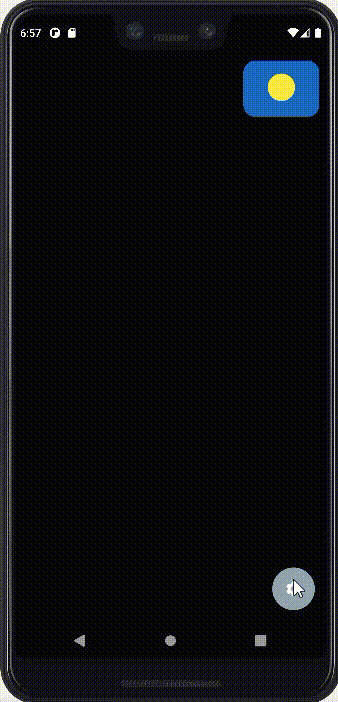

# Advanced Widgets

Это учебное Flutter приложение  по созданию виджета, представляющего собой иконку текущей погоды. Данный виджет имеет два крайних состояния: ясно и очень облачно с дождём. Виджет имеет  параметр степень облачности, который может принимать значения от 0 до 1. В зависимости от значения параметра может меняться картинка и текст на иконке.

Когда степень облачности равна нулю, то выводится солнце. Если степень облачности равна 0.2, то облако начинает проявляться и обретать непрозрачность. Если степень облачности  равна 0.5, то облако становится полностью непрозрачным. При дальнейшем увеличении степени облачности облако меняет цвет. При значении 1 скрывается солнце и выводится дождь.

В виджете реализована возможность масштабирования иконки. Когда пользователь нажимает на иконку погоды, она увеличивается и появляется текстовая информация.

В приложении реализована возможность выбора темной или светлой цветовой темы.

